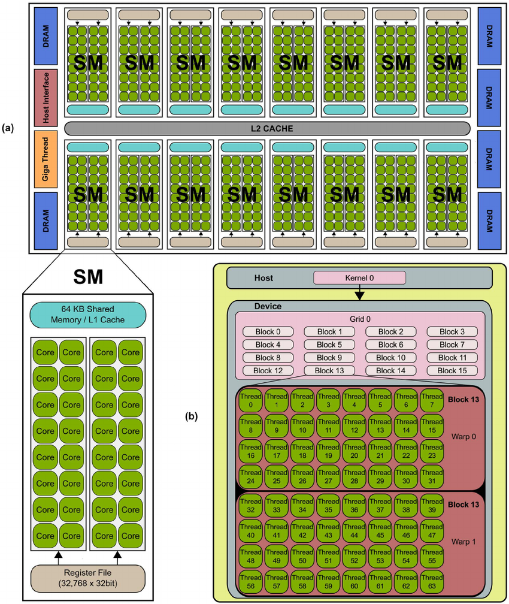
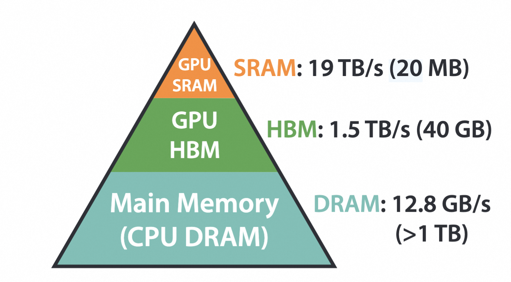
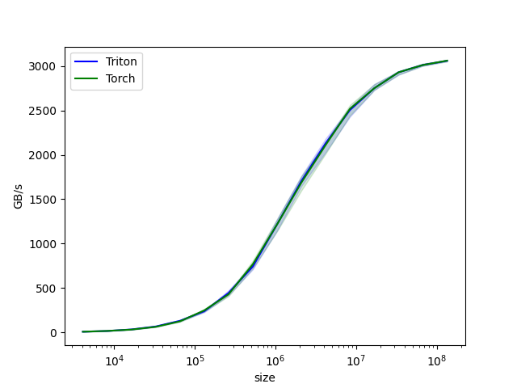
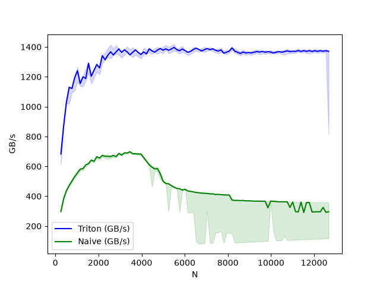

## GPU Architecture Basics

### GPU Architecture

A modern GPU is composed of multiple **Streaming Multiprocessors (SMs)**. Each SM contains many cores and a small **on-chip SRAM** (e.g., 64 KB), which includes both **shared memory** and **L1 cache**. All SMs share a single **L2 cache**, while the remaining data is typically stored in **off-chip memory such as DRAM or HBM**.

When a kernel is launched from the host, each SM can process multiple blocks simultaneously, and each block is executed in groups called **warps** — the minimal unit of execution on a GPU, typically consisting of 32 threads.




### GPU Memory Hierarchy



- **SRAM (Static Random Access Memory)** refers to **on-chip memory**. It is extremely fast, but also limited in capacity and relatively expensive. Typical examples include:
  - Registers
  - Shared Memory / L1 Cache
  - L2 Cache
- **HBM (High Bandwidth Memory)** is a specialized form of DRAM designed to provide very high bandwidth. It is typically packaged closer to the GPU, enabling faster data transfer.
- **DRAM (Dynamic Random Access Memory)** is traditional **off-chip memory**. It offers much larger capacity than SRAM, but with significantly higher latency and lower speed.

> Triton abstracts away many low-level details of how GPUs work so that we don't have to think about them.


## Introduction to Triton

Triton is a programming language that allows developers to write CUDA kernels quickly in Python while achieving performance close to CUDA C++.

### Minimal Example

Unlike CUDA C++, which is thread-level, Triton is a **block-level** programming language. In Triton, the smallest execution unit is a block, and each block is indexed by a program ID.

**Example: Triton Addition Kernel**

```python
import torch
import triton
import triton.language as tl

@triton.jit
def triton_add_kernel(
    x_ptr, y_ptr, z_ptr, N, 
    BLOCK_SIZE: tl.constexpr
):
    # program index
    pid = tl.program_id(axis=0)
    
    offsets = BLOCK_SIZE * pid + tl.arange(0, BLOCK_SIZE) # block start + [0 : BLOCK_SIZE]
    mask = offsets < N

    # load block data from DRAM/HBM to SRAM Memory
    x = tl.load(x_ptr + offsets, mask=mask, other=0.0)
    y = tl.load(y_ptr + offsets, mask=mask, other=0.0)

    z = x + y
	
    # write data back to DRAM
    tl.store(z_ptr + offsets, value=z, mask=mask)
```


**Launch A Kernel**

```python
def triton_add(x, y):
    assert x.is_cuda and y.is_cuda
    assert x.device == y.device
    assert x.shape == y.shape

    original_shape = x.shape
    x, y = x.reshape(-1), y.reshape(-1)
    z = torch.empty_like(x, device=x.device)

    N = x.numel()
    BLOCK_SIZE = 1024
    grid = lambda meta: (triton.cdiv(N, meta["BLOCK_SIZE"]),)

    triton_add_kernel[grid](
        x_ptr=x, y_ptr=y, z_ptr=z,
        N=N, BLOCK_SIZE=BLOCK_SIZE
    )

    return z.reshape(original_shape)
```

### Benchmarking

We can use `triton.testing.perf_report` to benchmark our CUDA kernel. Below is an example of benchmarking addition kernel.

```python
@triton.testing.perf_report(
    triton.testing.Benchmark(
        x_names=["size"],
        x_vals=[2 ** i for i in range(12, 28)],
        x_log=True,
        line_arg="provider",
        line_vals=["triton", "torch"],
        line_names=["Triton", "Torch"],
        styles=[("blue", "-"), ("green", "-")],
        ylabel="GB/s",
        plot_name="vector-add-performance",
        args={},
    )
)
def benchmark(size, provider):
    x = torch.randn(size, device=DEVICE)
    y = torch.randn(size, device=DEVICE)

    quantiles = [0.5, 0.05, 0.95]

    if provider == "torch":
        ms, min_ms, max_ms = triton.testing.do_bench(lambda: x + y, quantiles=quantiles)
    if provider == "triton":
        ms, min_ms, max_ms = triton.testing.do_bench(lambda: triton_add(x, y), quantiles=quantiles)

    gbps = lambda ms: 3 * x.numel() * x.element_size() * 1e-9 / (ms * 1e-3)

    return gbps(ms), gbps(min_ms), gbps(max_ms)

if __name__ == "__main__":
    benchmark.run(save_path='.', print_data=False)
```




## Fused Softmax

Compared to some operations implemented with naive PyTorch, Triton can significantly accelerate the computation by reducing IO reads and writes. Softmax is a typical example.

**Naive Softmax**

```python
def naive_softmax(x: torch.Tensor):
    # assume input size (M, N)
    
    x_max, _ = x.max(dim=-1, keepdim=True)
    # read MN, write M
    
    x_exp = (x - x_max).exp()
    # read MN + N, write MN, read MN, write MN
    
    x_exp_sum = x_exp.sum(dim=-1, keepdim=True)
    # read MN, write MN

    return x_exp / x_exp_sum # read MN * 2, write MN
```

As we can see, the naive softmax performs a lot of IO reads and writes from HBM.

**Fused Softmax Implemented In Triton**

```python
# get the GPU properties
properties = triton.runtime.driver.active.utils.get_device_properties(DEVICE.index)

NUM_SM = properties["multiprocessor_count"]
NUM_REGS = properties["max_num_regs"]
TOTAL_SRAM_PER_SM = properties["max_shared_mem"]
WARP_SIZE = properties["warpSize"]


def softmax(x):
    assert x.ndim == 2
    n_rows, n_cols = x.shape
    BLOCK_SIZE = triton.next_power_of_2(n_cols)
    
    num_warps = 4
    if BLOCK_SIZE >= 2048:
        num_warps = 8
    if BLOCK_SIZE >= 4096:
        num_warps = 16
	
    num_stages = 4 if TOTAL_SRAM_PER_SM > 200_000 else 2
    
    y = torch.empty_like(x)
    
    kernel = _softmax_kernel.warmup(
        x, y,
        x.stride(0), x.stride(1),
        y.stride(0), y.stride(1),
        n_rows, n_cols,
        BLOCK_SIZE=BLOCK_SIZE,
        num_stages=num_stages,
        num_warps=num_warps,
        grid=(1, 1, 1)
    )
    kernel._init_handles()
    n_regs_per_program = kernel.n_regs
    sram_needed_per_program = kernel.metadata.shared
    # Warm up the kernel, get the resource consumption
    
    reg_occupancy = NUM_REGS // (n_regs_per_program * WARP_SIZE * num_warps)
    sram_occupancy = TOTAL_SRAM_PER_SM // sram_needed_per_program
    
    programs_per_sm = min(reg_occupancy, sram_occupancy)
    num_programs = min(NUM_SM * programs_per_sm, n_rows)
    
    grid = (num_programs, 1, 1)
    
    kernel[grid](
        x, y,
        x.stride(0), x.stride(1),
        y.stride(0), y.stride(1),
        n_rows, n_cols
    )

    return y
```

**Actual Kernel**

```python
@triton.jit
def _softmax_kernel(
    input_ptr, output_ptr,
    input_row_stride, input_col_stride,
    output_row_stride, output_col_stride,
    n_rows, n_cols,
    BLOCK_SIZE: tl.constexpr,
    num_stages: tl.constexpr
):
    # shape (M, N)
    pid = tl.program_id(0)
    row_step = tl.num_programs(0)
    
    for row_idx in tl.range(pid, n_rows, row_step, num_stages=num_stages):
        row_start_ptr = input_ptr + row_idx * input_row_stride
        col_offsets = tl.arange(0, BLOCK_SIZE)
        input_ptrs = row_start_ptr + col_offsets * input_col_stride
        mask = col_offsets < n_cols
        
        row = tl.load(input_ptrs, mask=mask, other=float('-inf'))
        # shape (BLOCK_SIZE, ), roughly (n_cols,)
        
        row_minus_max = row - tl.max(row)
        numerator = tl.exp(row_minus_max)
        denominator = tl.sum(numerator)
        
        softmax_output = numerator / denominator
        
        output_row_start_ptr = output_ptr + row_idx * output_row_stride
        output_ptrs = output_row_start_ptr + col_offsets * output_col_stride
        tl.store(output_ptrs, softmax_output, mask=mask)
```

> **Why do we use stride here?**
>
> Actually, tensors are not always contiguous in memory, a stride specifies the number of elements to skip from the current address to the address of the next index along a certain dimension.
>
> For example, a contiguous matrix `x` of shape `(M, N)` has `x.stride() == (N, 1)`, while its transpose has a stride of `(1, M)`. **Thus, in PyTorch, transposing a matrix only modifies its stride information.**

**Benchmarking**

Now we benchmark the Triton kernel against the naive softmax implementation. As shown in the image below, the Triton kernel achieves a significant speedup over the naive version. This is because **the fused kernel dramatically reduces memory I/O** — **intermediate results stay on-chip instead of being written to and read back from HBM**. In this benchmark, we compute the softmax of a tensor of shape `(M, N)` with `M` fixed at 1024.


